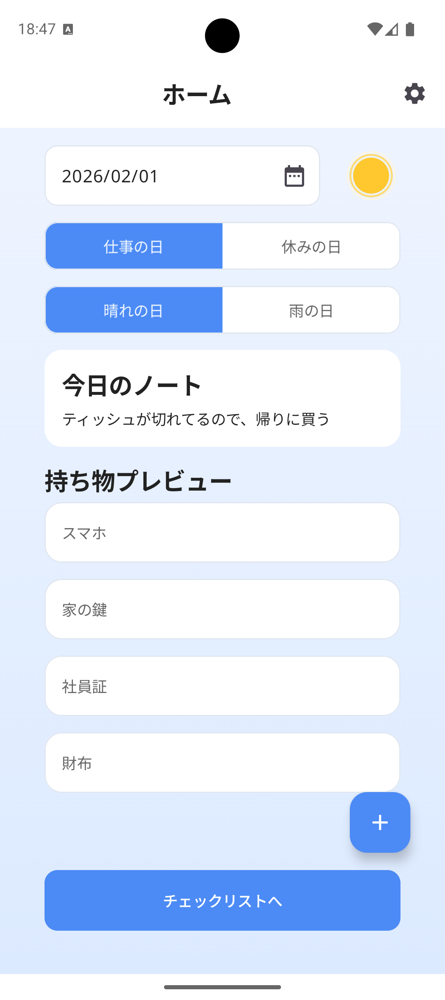
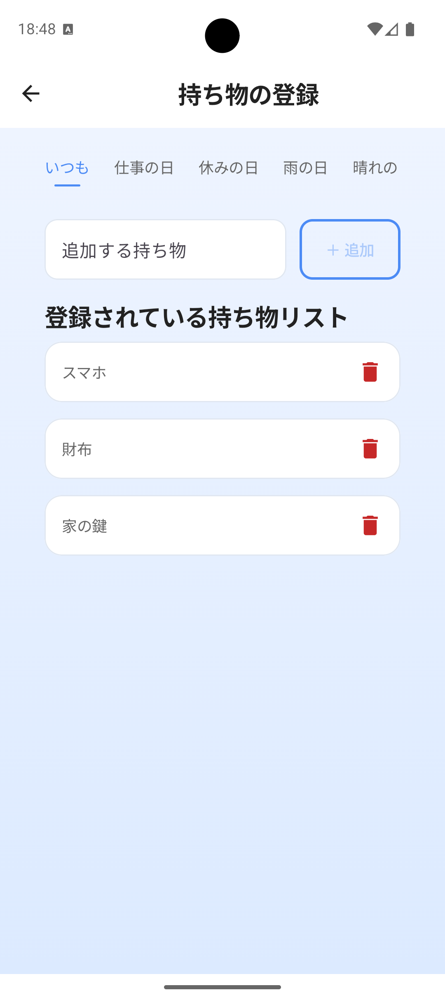
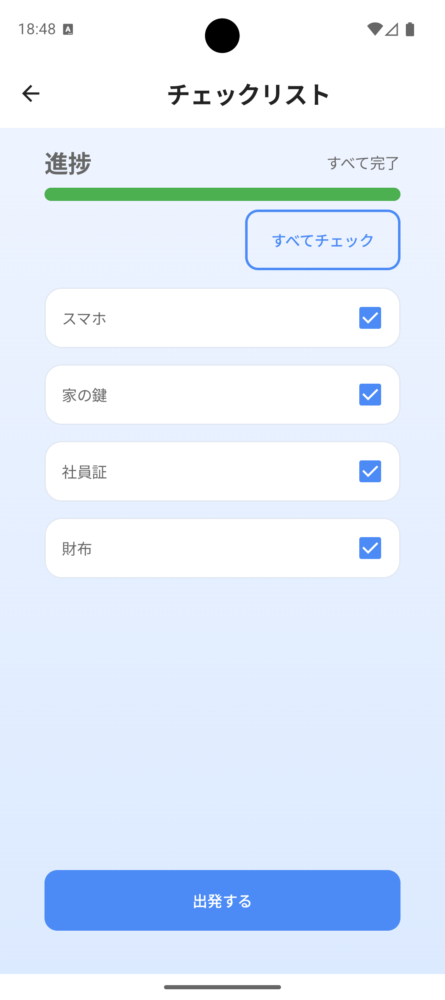
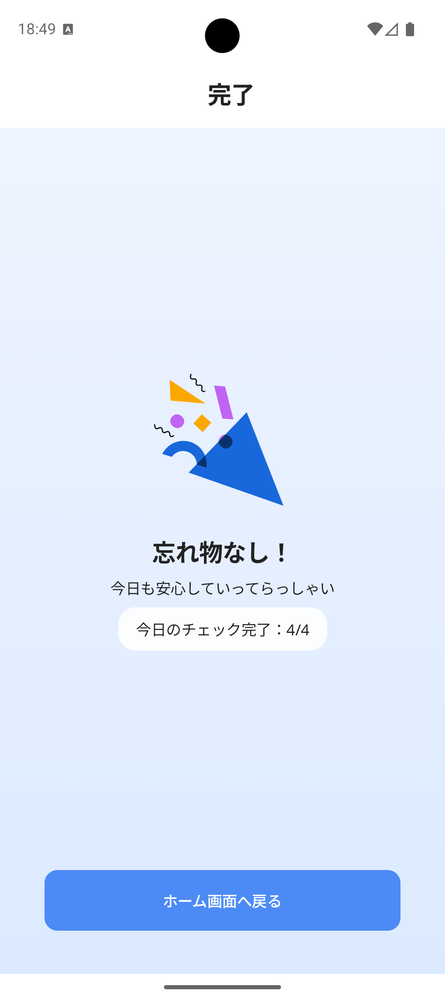
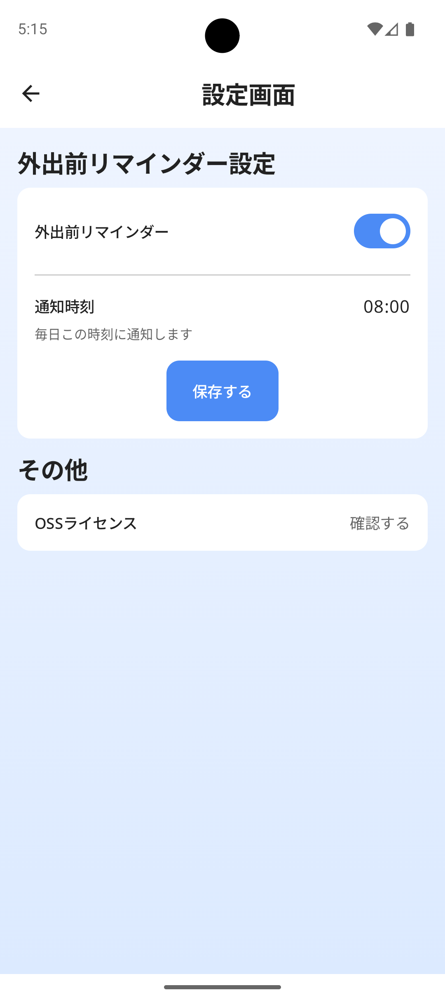
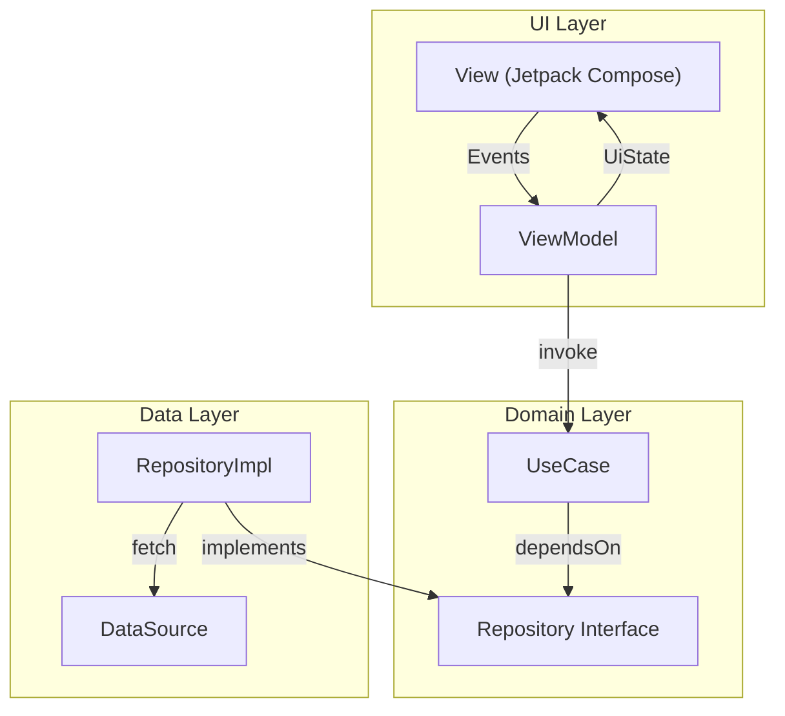

# SmartGo 🚪

  

SmartGoは、外出前の「忘れ物の不安」を減らすことを目的としたAndroidアプリです。 
仕事の日・お休みの日・天気（晴れ / 雨）・特定の日付といったシンプルな条件に応じて、必要な持ち物を自動で抽出し、チェックリストを生成します。 
外出前にチェックリストを確認することで、安心して一日をスタートできます。

---

## Features 🚀

- **チェックリスト生成**
  - 仕事の日 / 休みの日、晴れ / 雨、特定の日付などの条件に応じて、必要な持ち物を自動で抽出します。
- **持ち物の登録・管理**
  - カテゴリごとに持ち物の追加・削除ができます。
- **外出前チェック**
  - チェックリストで準備状況を可視化し、全てチェック完了後に完了画面へ遷移できます。
- **デイリーノート**
  - ホーム画面から当日のメモを編集・保存できます。
- **リマインダー通知設定**
  - 通知の ON/OFF と通知時刻を設定し、外出前にリマインダー通知を受け取れます。

---

## Screenshot 📸

| Home                                                      | Items                                                      | Checklist                                                      | Done                                                      | Settings                                                      |
| --------------------------------------------------------- | ---------------------------------------------------------- | -------------------------------------------------------------- | --------------------------------------------------------- | ------------------------------------------------------------- |
|  |  |  |  |  |

---

## Tech Stack ⚙️

- Programming Language
  - Kotlin
- UI
  - Jetpack Compose
  - Material3
- Navigation
  - Navigation3
- Database
  - Room
- Data Storage
  - DataStore
- Dependency Injection
  - Hilt
- Permission Management
  - Accompanist Permissions
- Testing
  - Kotest
- Static Analysis / Lint
  - Detekt
  - Ktlint
- Animation
  - Lottie

---

## Architecture 🏗️

MVVM + Repositoryパターンをベースに、UI / Domain / Data の3レイヤ構成を採用しています。 
Clean Architectureを参考に、依存関係を内側（Domain）へ向ける設計とすることで、ビジネスロジックをフレームワークから独立させています。

- UI: Compose / ViewModel
- Domain: UseCase / Model / Repository interface (Pure Kotlin)
- Data: Repository implementation / Room / DataStore

---

## Module Structure 📦

マルチモジュール構成を採用しています。 
Domainレイヤ（`:core:domain`）を依存関係の中心に配置し、依存を内側へ寄せる構造としています。 
UI / Data レイヤはDomainに依存する形で整理し、責務の分離と依存関係の明確化を図っています。

- `:app`
- `:core`
  - `:core:ui`
  - `:core:domain`
  - `:core:data`
  - `:core:navigation`
  - `:core:common`
  - `:core:notification`
  - `:core:test`
- `:feature`
  - `:feature:home`
  - `:feature:checklist`
  - `:feature:items`
  - `:feature:done`
  - `:feature:settings`

モジュール間の依存関係の全体像は以下のドキュメントにまとめています。  
[ModuleStructure.drawio](docs/architecture/ModuleStructure.drawio)

---

## Git Hooks（Lefthook）🪝

Git Hooksの管理にはLefthookを使用しています。 
コミット前・プッシュ前にコード品質チェックやテストを自動実行することで、品質を担保しています。 

- pre-commit
  - `./gradlew ktlintCheck`
- pre-push（parallel）
  - `./gradlew detekt`
  - `./gradlew :core:domain:test`

---

## CI/CD 🤖

GitHub Actionsを利用してCI/CDパイプラインを構築しています。 
開発ビルドはFirebase App Distributionで配信し、 
本番リリースは Firebase App DistributionとGitHub Releasesを通じて配信しています。

- CI
  - 静的解析（Detekt / Ktlint）
  - ユニットテスト（Kotest）
- CD
  - Firebase App Distributionへの配信（開発ビルド）
  - Firebase App Distributionおよび GitHub Releases への配信（本番ビルド）
  - GitHub Releasesによるリリースノート自動生成

---

## License 📄

MIT
