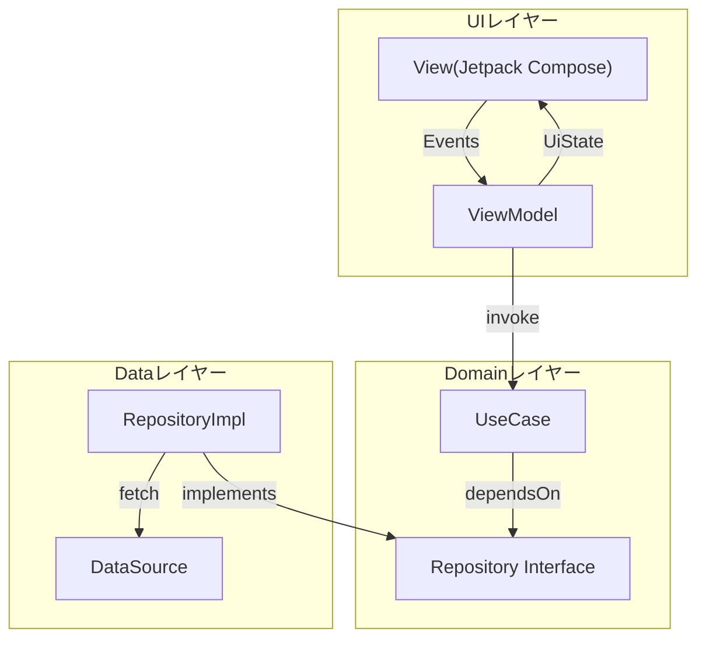

## Architecture Overview

本アプリはMVVMをベースに、UI、ビジネスロジック、データ取得の責務を分離するためにUI / Domain / Data の3レイヤで構成しています。
アプリの中核となるビジネスロジックやユースケースはDomainに集約し、UIはViewModelを介してビジネスロジックを使用します。
データ取得はRepositoryに集約し、外部I/Oの詳細をUIから隠蔽しています。
クリーンアーキテクチャの考え方（依存を内側へ）を参考に、変更に強い構造となっています。



## Module Dependency Structure

本アプリでは、機能ごとの責務分離とビルド影響範囲の限定を目的に、マルチモジュール構成を採用しています。
設計方針としては Domain（:core:domain）を中心に依存を内側へ寄せることを目指し、UI / Dataから Domainを利用する形で整理しています。
モジュール間の依存関係の全体像は、以下のドキュメントにまとめています。

```
docs/airchitecture/ModuleStructure.drawio
```
