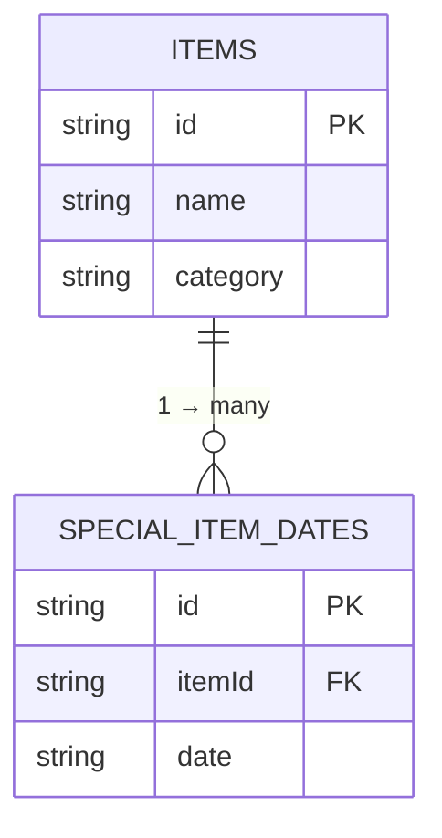

```mermaid
erDiagram
    ITEMS ||--o{ SPECIAL_ITEM_DATES : "1 → many"

    ITEMS {
        string id PK
        string name
        string category
    }

    SPECIAL_ITEM_DATES {
        string id PK
        string itemId FK
        string date
    }
```
